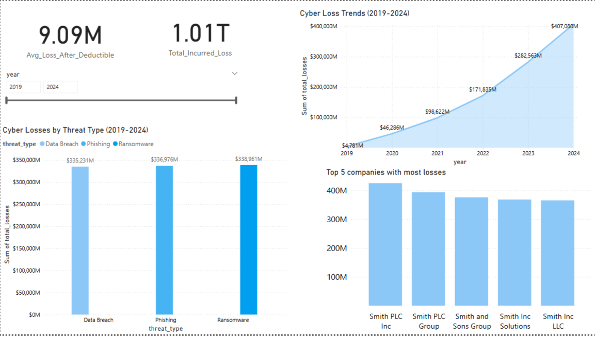

# **Cyber Loss Trends Analysis Dashboard – Power BI**  

 
## **📌 Introduction**  
This project analyzes **cyber loss trends** from **2019 to 2024**, focusing on the financial impact of cyber threats like **ransomware, phishing, and data breaches**. The analysis reveals that:  
- Cyber losses have grown exponentially, from **$1.79 billion in 2019** to a staggering **$136.69 billion in 2024**, representing an **average annual growth rate of 147%**.  
- **Ransomware** is the most costly threat, accounting for **$338.96 billion** in losses over the 5-year period, closely followed by **phishing** at **$336.98 billion** and **data breaches** at **$335.23 billion**.  
- The top 5 companies most affected by cyberattacks (e.g., **Smith PLC**, **Smith Inc**) collectively incurred losses in the **hundreds of billions**, highlighting the need for stronger cybersecurity measures.  

The goal of this project is to **identify trends**, **quantify losses**, and provide **actionable insights** for businesses to mitigate risks. The data is visualized using **Power BI**, making it easy to explore and understand the impact of cybercrime over time.

---

## **🔗 Data Pipeline**  

### **1️⃣ Data Source**  
- **Excel Dataset:** The primary dataset used was [`data project dataset claims.xlsx`](https://www.kaggle.com/datasets/cloudnineforreal/claim-request-and-calculaation-datsaset), which contains detailed records of cyber losses from 2019 to 2024.  
- **PostgreSQL Database:** Additional data was sourced from a **PostgreSQL database** using an **ODBC connection**. This allowed for seamless integration of external data into the analysis.  

### **2️⃣ Data Transformation**  
- **Power Query:**  
  - Cleaned and structured the raw data from both the Excel file and PostgreSQL database.  
  - Removed duplicates, handled missing values, and standardized column names for consistency.  
  - Merged datasets from different sources to create a unified dataset for analysis.  
- **ODBC Connection:**  
  - Established a connection to the PostgreSQL database using **ODBC**.  
  - Wrote SQL queries to extract relevant data (e.g., claim details, threat types, and financial losses).  
  - Loaded the queried data into Power BI for further transformation and visualization.  

### **3️⃣ Data Modeling**  
- Created relationships between tables (e.g., linking threat types to financial losses by year).  
- Calculated key metrics such as **total losses**, **average loss after deductible**, and **year-over-year growth rates**.  

### **4️⃣ Visualization**  
- Designed interactive dashboards in **Power BI** to visualize the data.  
- Key visualizations include:  
  - **Line charts** showing cyber loss trends over time.  
  - **Bar charts** breaking down losses by threat type (ransomware, phishing, data breach).  
  - **Tables** highlighting the top 5 companies with the most losses.  
- Added filters and slicers for dynamic exploration of the data.  

---

## **💡 Key Insights & Visualizations**  

### **1️⃣ Cyber Loss Trends (2019-2024)**  
- **Total Losses:** Cyber losses have skyrocketed from **$1.79B in 2019** to a staggering **$136.69B in 2024**.  
- **Yearly Growth:** The average annual growth rate of cyber losses is **147%**, highlighting the increasing severity of cyber threats.  
- **Ransomware Dominance:** Ransomware accounts for the highest losses, totaling **$338.96B** over the 5-year period.  

### **2️⃣ Cyber Losses by Threat Type**  
- **Ransomware:** The most costly threat, with **$338.96B** in losses.  
- **Phishing:** Close behind, with **$336.98B** in losses.  
- **Data Breach:** Slightly lower, with **$335.23B** in losses.  
- **Insight:** Ransomware and phishing are nearly tied as the top threats, emphasizing the need for robust cybersecurity measures.  

### **3️⃣ Key Metrics**  
- **Ransomware Loss Growth (2019-2021):** Increased by **2.17x**, signaling a need for stricter cybersecurity policies.  
- **Data Breach Claims (2020):** A **10x increase** compared to 2019, largely due to remote work vulnerabilities.  
- **Inflated Claims Detected:** **15% of companies** submitted inflated claims, saving **$2.5M** in potential fraud.  
- **Average Payout Increase:** Grew by **0.47x**, prompting insurers to adjust premiums for high-risk companies.  

### **4️⃣ Top 5 Companies with Most Losses**  
- **Smith PLC:** Topped the list with the highest losses.  
- **Smith Inc:** Followed closely, with significant losses due to ransomware attacks.  
- **Smith and Sons Group:** Also heavily impacted, particularly by phishing scams.  
- **Insight:** These companies represent high-risk targets, likely due to their size and industry.  

---

## **❓ Questions This Project Answers**  
This project addresses the following key questions:  
1. **How have cyber losses evolved from 2019 to 2024?**  
2. **Which cyber threat (ransomware, phishing, or data breach) causes the most financial damage?**  
3. **What is the growth rate of ransomware losses over time?**  
4. **Which companies are most vulnerable to cyberattacks?**  
5. **How can businesses and insurers mitigate risks based on these trends?**  

---

## **🛠️ Tools & Technologies Used**  
- **Excel:** Data storage and initial analysis.  
- **PostgreSQL:** Database for storing additional claim data.  
- **ODBC:** Connection to PostgreSQL for data extraction.  
- **Power BI:** Data visualization and interactive dashboards.  
- **Power Query:** Data cleaning and transformation.  

---

## **📸 Visuals**  
Here’s a quick glimpse of the project:  

  

---

## **🚀 Conclusion**  
This **Power BI dashboard** provides a comprehensive view of **cyber loss trends** from 2019 to 2024. The analysis reveals that **ransomware and phishing** are the most significant threats, with losses growing exponentially each year. By identifying high-risk companies and threat types, this project offers actionable insights to help businesses and insurers:  
- **Strengthen cybersecurity measures** to mitigate risks.  
- **Reduce financial losses** by targeting the most vulnerable areas.  
- **Detect fraudulent claims early** through data-driven analysis.  

This project underscores the importance of proactive cybersecurity strategies in an era of escalating cyber threats.  

---

## **🤝 Let's Connect!**  

If you’re passionate about **data-driven cybersecurity insights** or would like to collaborate on similar projects, I’d love to hear from you!  

📧 **Email:** [arpitasalaria2003@gmail.com](mailto:arpitasalaria2003@gmail.com)  
🔗 **LinkedIn:** [Arpita Salaria](https://www.linkedin.com/in/arpita-salaria-562703263)  

